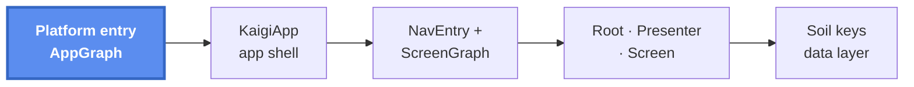
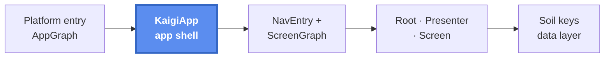
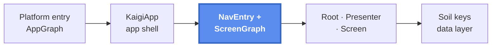
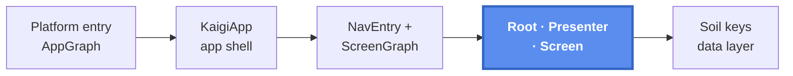
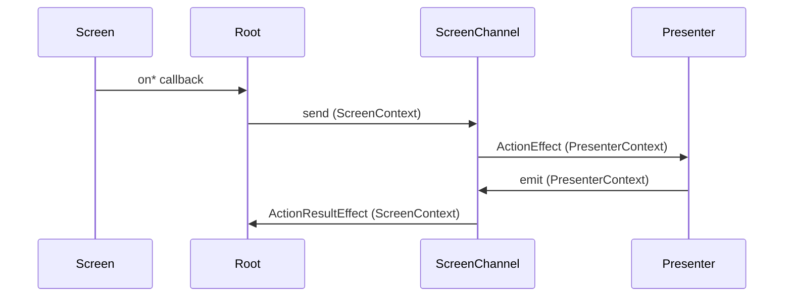
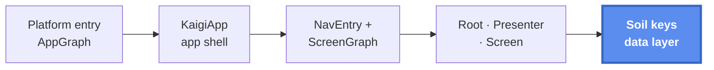

# アーキテクチャ概要

このページは、1 つのリクエストを端から端まで追いかけます。プラットフォームのエントリポイントから、依存性注入、ナビゲーション、データレイヤーを経て、描画され操作できる feature の画面までです。各部品がどう噛み合うかを見るには、上から下へ読んでください。各層からは、その詳細を所有するページへリンクしています。

中心となるスタックは次のとおりです。4 つのプラットフォーム（Android / デスクトップ JVM / iOS / Web）すべてで UI を共有する Compose Multiplatform、UI 状態のための composable な Presenter、デフォルトで永続化するキャッシュを備えたデータレイヤーの [Soil](./soil-keys.ja.md)、コンパイル時の依存性注入の [Metro](./di-app-graph.ja.md)、そしてすべてのプラットフォームでバックスタックを担う [Navigation3](./navigation.ja.md) です。唯一のネイティブな例外が iOS の [Liquid Glass タブバー](./ios-liquid-glass.ja.md) です。

同じ全体図が各セクションの冒頭で繰り返され、そのセクションが扱う部分がハイライトされます。

## 1. プラットフォームのエントリ — AppGraph の実現



各プラットフォームは、`AppGraph` の契約を実現し `KaigiApp` を起動する terminal モジュールを持ちます。`AppGraph` は `app-shared` で宣言された素のインターフェースであり、各プラットフォームはそれを `AppScope` にスコープされた Metro の `@DependencyGraph` として実現します。`AndroidAppGraph`、`DesktopAppGraph`、`WebAppGraph`、`IosAppGraph` です。それぞれの実現が独立した terminal モジュールに置かれているのは、Metro のグラフが自身のコンパイルクラスパス上の `@Contributes*` バインディングだけを集約するからです。terminal モジュールは `app-shared` の `api` 依存を継承するため、そこではすべての feature モジュールと core モジュールが見えます。

Android では、`Application` がグラフを一度だけ構築し（グラフファクトリを通じて `Context` を渡します）、`Activity` がそれを `KaigiApp` の周囲でコンテキストとして開きます。

```kotlin
class KaigiApplication : Application() {
    val appGraph: AppGraph by lazy {
        createGraphFactory<AndroidAppGraph.Factory>().create(applicationContext)
    }
}

class MainActivity : ComponentActivity() {
    override fun onCreate(savedInstanceState: Bundle?) {
        super.onCreate(savedInstanceState)
        setContent {
            context(appGraph) {
                KaigiApp()
            }
        }
    }
}
```

ほかのプラットフォームも、それぞれのエントリポイントで同じ 2 つのステップを繰り返します。デスクトップと Web は `main` で `createGraph<…>()` を呼び、iOS は同じ `KaigiApp` の呼び出しを `UIViewController` で包みます。`KaigiApp` は `AppGraph` インターフェースにしか依存しないため、共有 UI はどのプラットフォームがそれを実現したのかを知ることがありません。[iOS 概要](./ios.ja.md) と [AppGraph と UiGraph](./di-app-graph.ja.md) を参照してください。

## 2. KaigiApp — 共有のシェル



`KaigiApp` は、すべての画面が前提とするアプリ全体の環境 — Soil クライアント、テーマ、エントリごとのサービス群 — を提供し、単一のバックスタック上でナビゲーションを駆動する層です。また UI スコープの `UiGraph`（[AppGraph と UiGraph](./di-app-graph.ja.md)）を retain するため、1 つの UI インスタンスが 1 つの navigator と entry provider を所有します。

```kotlin
context(appGraph: AppGraph)
@Composable
fun KaigiApp() {
    val uiGraph = retain { appGraph.uiGraph }
    val backStack = context(uiGraph) { rememberKaigiBackStack() }
    SwrClientProvider(uiGraph.swrClient) {       // Soil client, available to every screen
        KaigiTheme(colorScheme = …) {            // color scheme subscribed via Soil
            NavigatorEffect(…)                   // AppNavigator commands → back stack
            NavDisplay(
                backStack = backStack,
                entryDecorators = …,             // per-entry: saveable state, retain store,
                                                 //   snackbar host
                sceneStrategies = …,             // root / list-detail / single pane
            )
        }
    }
}
```

画面ごとのサービスが環境のように感じられるのは、entry decorator によるものです。各エントリは自身の retain されたストア（画面のグラフは一時的な破棄を生き延びます）と自身の `SnackbarHostState` を持ち、どちらも CompositionLocal を通じて公開されます。シーン、デコレーター、predictive back の仕組みの詳細は [ナビゲーション概要](./navigation.ja.md) を参照してください。

## 3. 画面にたどり着くまで



`NavDisplay` は、バックスタックの最上段にある `NavKey` が何であれ、それを描画します。そのキーは `uiGraph.appEntryProvider.entryProvider` を通じて解決されます。これは `Set<NavEntryProvider>` から組み立てられた集約済みの関数です。各 feature は `@ContributesIntoSet(UiScope::class)` を付けて自身の `NavEntryProvider` を提供し、`AppEntryProvider` が `app-shared` でそれらをマージします。画面を追加しても中央のレジストリを編集することはありません。[NavEntry の集約（NavEntryProvider）](./navigation-entry-aggregation.ja.md) を参照してください。

feature のプロバイダーは次のようになります（このページのコードは読みやすさのために簡略化しています。正確なシグネチャはリンク先のページにあります）。

```kotlin
@ContributesIntoSet(UiScope::class)
@Inject
class TimetableNavEntryProvider(
    private val screenGraphFactory: TimetableScreenGraph.Factory,
) : NavEntryProvider {
    override fun EntryProviderScope<NavKey>.register() {
        entry<TimetableNavKey> {
            // the per-screen graph survives transient destruction of the entry
            val graph = retain(screenGraphFactory::createTimetableScreenGraph)
            context(graph.screenContext) {
                TimetableScreenRoot(
                    onNavigateToDetail = graph.screenNavigator::openSessionDetail,
                )
            }
        }
    }
}
```

retain されたグラフは、その画面の `ScreenContext` を公開する Metro の `@GraphExtension` であり、エントリはそのコンテキストを Root の周囲で開きます。[画面ごとのグラフ（@GraphExtension）](./di-screen-graph.ja.md) と [ScreenContext の設計](./screen-context.ja.md) を参照してください。

## 4. 画面の内部



各画面は Root / Presenter / Screen の 3 つ組です。Root が全体の形を示します。

```kotlin
context(screenContext: TimetableScreenContext)
@Composable
fun TimetableScreenRoot(onNavigateToDetail: (TimetableItemId) -> Unit) {
    SoilDataBoundary(                       // loading & error handled here
        state1 = rememberQuery(screenContext.timetableQueryKey),
    ) { timetable ->
        val screenChannel = retainScreenChannel<Action, ActionResult>()

        ActionResultEffect(screenChannel) { result ->
            // presenter-originated one-offs: show a snackbar, navigate, …
        }

        val uiState = context(screenContext.presenterContext) {
            timetableScreenPresenter(screenChannel, timetable)
        }

        TimetableScreen(
            uiState = uiState,
            onBookmarkClick = { screenChannel.send(Action.Bookmark(it)) }, // real work → presenter
            onItemClick = onNavigateToDetail,                              // navigation-only → straight through
        )
    }
}
```

- **Presenter** は `PresenterContext` のスコープで動作します。Soil のキーを読み、イミュータブルな `UiState` を組み立て、`ActionEffect` を通じてアクションを消費し、`mutateAsync` でミューテーションを駆動します。
- **Screen** は `UiState` とコールバックだけからなる純粋な `@Composable` です。Soil にもチャネルにも決して触れません。

`ScreenChannel` は双方向を運び、各端は context parameter によって守られています。`send` と `ActionResultEffect` は `ScreenContext` を必要とし、`ActionEffect` と `emit` は `PresenterContext` を必要とします。誤った層から誤った端を使うことは、ごく普通のコンパイルエラーになります。

上の 2 つのコールバックは経路が異なります。**ナビゲーションだけを行うクリックは、ナビゲーションのラムダへそのまま抜けます。** チャネルを通るのは、実際の処理を行うアクションだけです。転送するだけのアクションハンドラーは `NoForwardOnlyActionChecker` という FIR checker が弾きます。契約とテストの全体は [画面の実装](./building-a-screen.ja.md)、[エラーハンドリング](./error-handling.ja.md) にあります。

ScreenChannel の往復を、小さな図で示します。



## 5. データレイヤー



Screen のデータは Soil のキーから来ます。キーはモジュールで分かれており、**契約** は `:core:model` に、**実装** は `:core:data` にあって、DI グラフを通じて結び付けられます。

```kotlin
// :core:model — the contract a feature depends on
typealias TimetableQueryKey = QueryKey<Timetable>

// :core:data — the implementation
@ContributesBinding(AppScope::class)
class DefaultTimetableQueryKey(…) : TimetableQueryKey by buildPersistedQueryKey(
    id = SoilIds.timetableQuery,
    persistKey = "timetable",
    fetchResponse = { api.getTimetable() },                // raw server response is persisted
    transformToDomainModel = { response -> Timetable(items = response.toTimetableItems().toPersistentList()) },
)
```

クエリはオフラインファーストです。`buildPersistedQueryKey` はサーバーの生のレスポンスを永続化し、起動時に復元するため、画面はキャッシュから即座に描画されます。永続化される型は `@Serializable` でなければならず、これはコンパイル時に強制されます。

画面の境界では、`SoilDataBoundary` がクエリとサブスクリプションの状態を 1 つの「読み込み済みコンテンツ」のコールバックへと変え、それ以外の場合はローディングとエラーのフォールバックを表示します。書き込みは `mutateAsync` を使ってミューテーションキーを通ります。成功と失敗は、手動での状態のやりくりではなく一度きりのエフェクト（`MutationSuccessEffect` / `MutationErrorEffect`）として現れ、各画面のミューテーションキャッシュは `MutationTag` によって分離されます。[Soil のキー](./soil-keys.ja.md)、[Soil の永続化](./soil-persistence.ja.md)、[SoilDataBoundary](./soil-data-boundary.ja.md)、[Soil のミューテーション](./soil-mutation.ja.md)、[プラットフォームとモジュール](./platforms-and-modules.ja.md) を参照してください。

## この形を保つ

この形全体は単なる規約ではありません。一連の FIR checker が、それを壊すコード（転送するだけのアクションハンドラー、直接呼び出されたミューテーション、エントリでラップされていない navigator の呼び出し、`PresenterContext` である `ScreenContext`）を弾きます。[Enforcement](./enforcement.ja.md) を参照してください。各層はそれぞれのやり方でカバーされています。Molecule ベースのハーネス上での Presenter のユニットテスト、実際の Root に対する Robot テスト、そして Roborazzi のスクリーンショットです。[テスト概要](./testing.ja.md) を参照してください。

関連: [画面の実装](./building-a-screen.ja.md) · [ScreenContext の設計](./screen-context.ja.md) · [エラーハンドリング](./error-handling.ja.md) · [Enforcement](./enforcement.ja.md)
