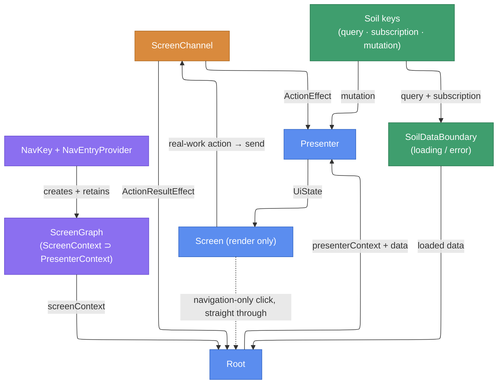

# 画面の実装

以下の各決定にはそれぞれ正式なページがあります。このページはそれらを 1 つの画面の実装順序としてまとめたものです。`:feature:sessions` の **TimetableScreen**（タイムテーブル一覧、お気に入り、詳細へのナビゲーション）を、データ層からナビゲーションまで順にたどります。画面がアプリ全体の中でどのように位置づけられるかについては、[アーキテクチャ概要 セクション 4](./architecture-overview.ja.md#_4-画面の内部) を参照してください。このページは手順を示し、あちらのページは流れを語ります。

> **近道 — まずスキャフォールドする。** `scripts/new-screen.sh --feature <feature> --screen <Screen>` は以下のすべてのファイル（`:core:model` / `feature` / `app-shared` にまたがる）を生成し、すべてのターゲットでコンパイルが通り、すべての FIR checker をパスします。Claude Code 向けには `new-screen` skill がこれをラップしています。生成されたファイルを骨組みとして使い、fetch、contract、UI を埋めてください。[AI 支援開発](./ai-development.ja.md) を参照してください。

## 登場人物とその関係

1 枚の図が、このページの残りの部分がたどる地図になります。各ノードはあなたが書くファイル（または小さなファイルの集まり）です。以下の各セクションは 1 つのノードに焦点を当て、そこに何を書くかを示します。

色はレイヤーを示します。紫 = ナビゲーションと DI、青 = 画面の 3 要素、アンバー = 一度限りのチャネル、緑 = Soil のデータ。



`Screen` から出る 2 本のエッジが要点です。**実作業**のクリックはチャネルを通って presenter に届き、**ナビゲーションのみ**のクリックは Root のナビゲーション用ラムダを通してそのまま戻され、presenter には決して届きません。ナビゲーションへ転送するだけのチャネルアクションを配線すると、`NoForwardOnlyActionChecker` FIR checker によって拒否されます。

## データ層 — Soil のキー

**図の `Soil keys` ノード。** キーの**契約**は `:core:model` の typealias です（キーごとに 1 ファイル）。`Default*Key` の**実装**は `:core:data` にあります。各 id は KSP が生成した `SoilIds` オブジェクトから来るため、id は安定し、手作業で衝突させることはできません。

ここで行うこと:
- `:core:model` でキーごとに typealias を 1 つ宣言し、`:core:data` でキーごとに `Default*Key` を 1 つバインドします。
- **重い整形（`groupBy` / `sortedBy` / join）は presenter ではなく `fetch` に集約します** — [Presenter のパフォーマンス](./presenter-performance.ja.md) を参照してください。
- サーバーの生のレスポンスは `buildPersistedQueryKey` で永続化します（`persistKey` は明示します。永続化する型は `@Serializable` でなければならず、コンパイル時に強制されます）。
- ミューテーションキーは画面ごとのスコープにバインドし、`MutationTag` を受け取るようにします。これにより各画面が別々のミューテーションキャッシュを保持します。

```kotlin
// :core:data — shaping happens in fetch; the raw response is what gets persisted.
@Inject
@ContributesBinding(AppScope::class)
class DefaultTimetableQueryKey(
    private val api: TimetableApi,
    private val fileStorage: ServerEnvironmentScopedFileStorage,
) : TimetableQueryKey by buildPersistedQueryKey(
    id = SoilIds.timetableQuery,          // generated from the typealias fully-qualified name
    persistKey = "timetable",             // stable, explicit persisted-cache identity
    fileStorage = fileStorage,
    fetchResponse = { api.getTimetable() },
    transformToDomainModel = { response -> Timetable(items = response.toTimetableItems().toPersistentList()) },
)

@Inject
@ContributesBinding(TimetableScreenScope::class)
@ContributesBinding(TimetableItemDetailScreenScope::class)
class DefaultFavoriteTimetableItemIdMutationKey(
    extraTag: MutationTag,                // provided by each screen's @GraphExtension
    private val store: FavoritesStore,
) : FavoriteTimetableItemIdMutationKey by buildMutationKey(
    id = SoilIds.favoriteTimetableItemIdMutation(extraTag),  // tag flows into the id (per-screen isolation)
    mutate = { id -> FavoriteToggle(id = id, added = store.toggle(id)) },
)
```

派生的な読み取りは、キーを追加するのではなく `rememberQuery(key, select)` で共有キーを再利用します。詳細画面は共有されたタイムテーブルのキャッシュから単一のアイテムを select します。[Soil のキー](./soil-keys.ja.md) と [Soil のミューテーション](./soil-mutation.ja.md) を参照してください。

## コンテキスト — ScreenContext が PresenterContext を保持する

**図の `ScreenGraph` ノード。** どちらのコンテキストも具象の `@Inject` クラスです。`ScreenContext` は `PresenterContext` をプロパティとして**保持**し（コンポジション）、継承はしません。

ここで行うこと:
- presenter の役割に関する依存（ミューテーションキー）だけを `PresenterContext` に置きます。
- クエリキーとサブスクリプションキー、そして `presenterContext` のインスタンスを `ScreenContext` に置き、`@SingleIn(<ScreenScope>::class)` を付けます。

```kotlin
@Inject
class TimetablePresenterContext(
    val favoriteTimetableItemIdMutationKey: FavoriteTimetableItemIdMutationKey,
    override val logger: KaigiLogger,
) : PresenterContext

@Inject
@SingleIn(TimetableScreenScope::class)
class TimetableScreenContext(
    val timetableQueryKey: TimetableQueryKey,
    val favoriteTimetableIdsSubscriptionKey: FavoriteTimetableIdsSubscriptionKey,
    override val logger: KaigiLogger,
    val presenterContext: TimetablePresenterContext,  // holds the instance; not `: TimetablePresenterContext`
) : ScreenContext
```

継承（is-a）ではなくコンポジション（保持）です。is-a であれば、Root が保持する `ScreenContext` が `PresenterContext` も満たしてしまい、アクションを消費する能力が Root に漏れ出します。この誤りは FIR checker によって拒否されます。その理由、retain、画面ごとの `@GraphExtension` の 3 点セットについては、[ScreenContext の設計](./screen-context.ja.md) を参照してください。

## Action / ActionResult / UiState

**図の `ScreenChannel` のエッジに付いたラベル。** `Action` はチャネルへの入力（UI → presenter）、`ActionResult` は一度限りの出力（presenter → Root）、`UiState` は描画の入力です。

ここで行うこと:
- 3 つそれぞれを、宣言にちなんだ名前の個別のファイルで宣言します（`<Screen>ScreenAction.kt`、`<Screen>ScreenActionResult.kt`、`<Screen>ScreenUiState.kt`）。アクションも一度限りの出力もない画面は `UiState` だけを宣言します。
- `Action` には**実作業**のアクションだけを列挙します（ナビゲーションのみのケースは含めません）。
- strong-skipping のために `UiState` はイミュータブルに保ちます（イミュータブルなコレクション）。

```kotlin
sealed interface TimetableScreenAction {                     // real-work input only
    data class Bookmark(val id: TimetableItemId) : TimetableScreenAction
    data class SelectDay(val day: DroidKaigi2026Day) : TimetableScreenAction
    // no ClickItem: opening a detail is navigation-only, wired Screen → Root directly
}

sealed interface TimetableScreenActionResult {               // one-off, presenter → Root
    data class ShowMessage(val message: UserMessage) : TimetableScreenActionResult
}

data class TimetableScreenUiState(
    val day: DroidKaigi2026Day,
    val sessions: PersistentList<TimetableItem>,
    val bookmarks: PersistentSet<TimetableItemId>,
)
```

## Presenter — 計算は軽く、PresenterContext のみ

**図の `Presenter` ノード。** `PresenterContext` を通して Soil のキーを読み、`ActionEffect` でアクションを消費し、イミュータブルな `UiState` を返します。

ここで行うこと:
- `context(presenterContext: <PresenterContext>)` を宣言し、`@Composable` を付けます。
- 入力は `ActionEffect` で消費し、書き込みは `mutateAsync` で行います（`mutate` は決して使いません）。
- 一度限りの出力は、ミューテーションの effect から `emit` を呼んで表面化させます。本体は軽く保ち、重い整形は行いません。

```kotlin
context(presenterContext: TimetablePresenterContext)
@Composable
fun timetableScreenPresenter(
    screenChannel: ScreenChannel<TimetableScreenAction, TimetableScreenActionResult>,
    timetable: Timetable,                            // arrives non-null from SoilDataBoundary
): TimetableScreenUiState {
    val favoriteMutation = rememberMutation(presenterContext.favoriteTimetableItemIdMutationKey)
    var selectedDay by retain { mutableStateOf(DroidKaigi2026Day.Day1) }

    ActionEffect(screenChannel) { action ->
        when (action) {
            is TimetableScreenAction.Bookmark  -> favoriteMutation.mutateAsync(action.id)
            is TimetableScreenAction.SelectDay -> selectedDay = action.day
        }
    }
    MutationErrorEffect(favoriteMutation) { error ->     // success reflects via the subscription; surface only failures
        screenChannel.emit(TimetableScreenActionResult.ShowMessage(error.toUserMessage()))
        favoriteMutation.reset()
    }

    return TimetableScreenUiState(
        day = selectedDay,
        sessions = timetable.itemsOn(selectedDay),       // cheap bucket lookup
        bookmarks = timetable.bookmarks,
    )
}
```

`emit` は `suspend` であるため effect の内部からしか発火できず、composition の本体から誤って発火することを封じています。`mutate` が禁止されている理由（`NoDirectMutate` checker）と、ミューテーションの effect の選び方は [Soil のミューテーション](./soil-mutation.ja.md) を参照してください。

## Screen — 描画のみ

**図の `Screen` ノード。** `UiState` とコールバックだけを受け取る純粋な `@Composable` であり、Soil にもチャネルにも決して触れません。

ここで行うこと:
- `uiState` を描画し、ユーザーが操作するコントロールから各コールバックを呼び出します。
- 2 種類のコールバックは区別して保ちます。実作業のクリックもナビゲーションのみのクリックも、ここでは単なるラムダです。それぞれの行き先は Root が決めます。

```kotlin
@Composable
fun TimetableScreen(
    uiState: TimetableScreenUiState,
    onBookmarkClick: (TimetableItemId) -> Unit,
    onDayClick: (DroidKaigi2026Day) -> Unit,
    onItemClick: (TimetableItemId) -> Unit,          // navigation-only click
) {
    // Render uiState; a click just invokes the passed callback.
}
```

## Root — データバウンダリ、チャネル、配線

**図の `Root` ノード** — 他のすべてのエッジが集まるハブです。その役割は `ScreenContext` のコンテキストパラメータと `*ScreenRoot` という名前によって識別され、アノテーションはありません。

ここで、この順番で行うこと:
- クエリとサブスクリプションの上に [`SoilDataBoundary`](./soil-data-boundary.ja.md) を開きます（ローディングとエラーのフォールバックはここで扱われます）。
- `retainScreenChannel` でチャネルを作り、presenter 由来の一度限りの出力は `ActionResultEffect` で扱います。
- presenter の呼び出し**だけ**を `context(screenContext.presenterContext) { … }` で包んで `UiState` を計算します。
- `Screen` を描画します。実作業のクリックは `screenChannel.send(…)` へ流し、ナビゲーションのみのクリックは Root のナビゲーション用ラムダへそのまま転送します。

```kotlin
context(screenContext: TimetableScreenContext)
@Composable
fun TimetableScreenRoot(onNavigateToDetail: (TimetableItemId) -> Unit) {
    SoilDataBoundary(
        state1 = rememberQuery(screenContext.timetableQueryKey),
        state2 = rememberSubscription(screenContext.favoriteTimetableIdsSubscriptionKey),
    ) { timetable, favoriteIds ->
        val screenChannel = retainScreenChannel<TimetableScreenAction, TimetableScreenActionResult>()
        val snackbarHostState = LocalSnackbarHostState.current

        ActionResultEffect(screenChannel) { result ->
            when (result) {
                is TimetableScreenActionResult.ShowMessage -> snackbarHostState.showSnackbar(result.message.text)
            }
        }

        val uiState = context(screenContext.presenterContext) {    // wrap only the presenter call
            timetableScreenPresenter(
                screenChannel = screenChannel,
                timetable = timetable.copy(bookmarks = favoriteIds),   // lightweight join
            )
        }
        TimetableScreen(
            uiState = uiState,
            onBookmarkClick = { screenChannel.send(TimetableScreenAction.Bookmark(it)) },  // send = ScreenContext-gated
            onDayClick      = { screenChannel.send(TimetableScreenAction.SelectDay(it)) },
            onItemClick     = onNavigateToDetail,   // navigation-only: forward the nav lambda, no presenter round-trip
        )
    }
}
```

`LocalSnackbarHostState` はエントリごとの Snackbar `NavEntryDecorator` から供給されます。join が重くなったら（複数の独立したソースを同期する場合）、`content` から `SubscriptionKey` の `combine(…)` へ移します。[エラーハンドリング](./error-handling.ja.md) と [Presenter のパフォーマンス](./presenter-performance.ja.md) を参照してください。

## ナビゲーション — NavKey、エントリ、画面ごとのグラフ

**図の、`ScreenGraph` に供給する `NavKey + NavEntryProvider` ノード。**

ここで行うこと:
- commonMain で `@Serializable` な `NavKey` を宣言します。
- `@ContributesIntoSet(UiScope::class)` で `NavEntryProvider` を提供します（中央の `NavDisplay` は決して編集しません）。
- エントリの中では、画面ごとのグラフファクトリを `retain` し、Root の周りで `graph.screenContext` を開き、ナビゲーションは `graph.screenNavigator::openSessionDetail` として渡します。

```kotlin
@Serializable
data object TimetableNavKey : NavKey

@ContributesIntoSet(UiScope::class)
@Inject
class TimetableNavEntryProvider(
    private val screenGraphFactory: TimetableScreenGraph.Factory,
) : NavEntryProvider {
    override fun EntryProviderScope<NavKey>.register() {
        entry<TimetableNavKey>(metadata = RootSceneStrategy.root()) {
            val graph = retain(screenGraphFactory::createTimetableScreenGraph)
            context(graph.screenContext) {
                TimetableScreenRoot(
                    onNavigateToDetail = graph.screenNavigator::openSessionDetail,
                )
            }
        }
    }
}
```

Root はナビゲーションをラムダとして受け取ります（テストとプレビューでは fake になります）。エントリはそれを retain されたグラフの `screenNavigator` から供給するため、navigator が `ScreenContext` に入ることはありません。ナビゲーションは画面固有の `TimetableScreenNavigator`（インターフェースは feature に、`DefaultTimetableScreenNavigator` は `app-shared` で画面スコープにバインドされます）→ `AppNavigator` → バックスタック、と流れます。画面ごとの `@GraphExtension` はこの画面の `MutationTag` も `@Provides` し、NavKey シリアライザの登録は feature ごとに KSP で生成されます。[ナビゲーション概要](./navigation.ja.md) と [Navigator](./navigation-navigator.ja.md) を参照してください。

## Compose view の命名規約

| 対象 | 命名 | 例 |
| --- | --- | --- |
| 画面のエントリ | `<Feature>ScreenRoot` | `TimetableScreenRoot` |
| 画面の描画ルート | `<Feature>Screen` | `TimetableScreen` |
| それ以外のすべての Compose view | `<Name><Kind>`（kind サフィックスは必須） | `TimetableView` / `SessionItem` / `FavoriteButton` |

`<Feature>Screen` 以外のすべての Compose view は kind サフィックスを付けなければなりません。`Timetable` のような裸の名前は禁止されています（`:core:model` の `Timetable` と衝突します）。最も具体的なウィジェットの kind を選びます（`Button` / `Card` / `Item` / `Field` / `Dialog` / `Bar` / `Chip` / `Section` …）。どれにも当てはまらない複合的なものには `View` を使います。画面固有の view は `feature` に、広く再利用できるものは `:core:ui` に置きます。

## テスト

ここで行うこと:
- `runPresenterTest`（内部で Molecule）による Presenter のユニットテスト。fake のキーを使って fake の `PresenterContext` を直接構築し、`uiStates` で `UiState` の遷移を、`results` で一度限りの出力をアサートします。
- Screen のテスト。本物の `TimetableScreenRoot` を composition する [Robot パターンテスト](./testing-robot.ja.md) と、`TimetableScreen.kt` のプレビューの Roborazzi スクリーンショット。

```kotlin
@Test
fun selectDay_switchesSessions() {
    val favoriteKey: FavoriteTimetableItemIdMutationKey = buildMutationKey(
        id = MutationId("test-favorite"),
        mutate = { /* record */ },
    )
    runPresenterTest(
        presenterContext = TimetablePresenterContext(
            favoriteTimetableItemIdMutationKey = favoriteKey,
            logger = FakeKaigiLogger(),
        ),
        presenter = { channel -> timetableScreenPresenter(channel, sampleTimetable) },
    ) {
        uiStates.awaitItem()                                            // initial UiState (Day1)
        send(TimetableScreenAction.SelectDay(DroidKaigi2026Day.Day2))
        assertEquals(DroidKaigi2026Day.Day2, uiStates.awaitItem().day)
    }
}
```

ナビゲーションのみのクリックには、テストすべき presenter の経路がありません。Screen → Root へ直接配線されています。[Presenter のユニットテスト（Molecule）](./testing-presenter.ja.md) を参照してください。

## 付録 — ファイル構成

```text
core/model/.../TimetableQueryKey.kt etc.                   // one file per key typealias (contract)
core/model/.../TimetableScreenScope.kt                    // @GraphExtension scope marker(s)
core/model/.../Timetable.kt                               // domain models
core/data/.../Default*Key.kt                              // one file per key impl (shaping in fetch)
feature/sessions/.../timetable/TimetableScreenContext.kt  // PresenterContext + ScreenContext
feature/sessions/.../timetable/TimetableScreenGraph.kt    // per-screen @GraphExtension (+ MutationTag @Provides)
feature/sessions/.../timetable/TimetableScreenAction.kt   // one file per contract declaration
feature/sessions/.../timetable/TimetableScreenActionResult.kt
feature/sessions/.../timetable/TimetableScreenUiState.kt
feature/sessions/.../timetable/TimetableScreenPresenter.kt
feature/sessions/.../timetable/TimetableScreen.kt         // Screen + previews
feature/sessions/.../timetable/TimetableScreenRoot.kt
feature/sessions/.../timetable/TimetableScreenNavigator.kt
feature/sessions/.../timetable/TimetableNavKey.kt
feature/sessions/.../timetable/TimetableNavEntryProvider.kt
feature/sessions/src/commonTest/.../timetable/TimetableScreenPresenterTest.kt
feature/sessions/src/commonTest/.../timetable/TimetableScreenRobot.kt + TimetableScreenRobotTest.kt
app-shared/.../DefaultTimetableScreenNavigator.kt         // Navigator impl, bound into the screen scope
```

関連: [アーキテクチャ概要](./architecture-overview.ja.md) · [ScreenContext の設計](./screen-context.ja.md) · [エラーハンドリング](./error-handling.ja.md) · [Soil のキー](./soil-keys.ja.md) · [Soil のミューテーション](./soil-mutation.ja.md) · [Presenter のパフォーマンス](./presenter-performance.ja.md) · [ナビゲーション概要](./navigation.ja.md) · [Enforcement](./enforcement.ja.md) · [AI 支援開発](./ai-development.ja.md)
