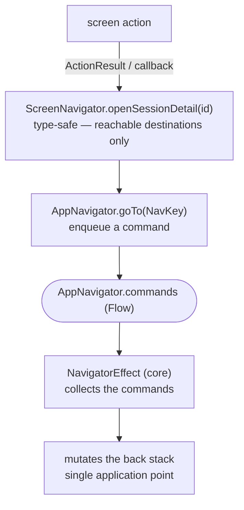

# Navigator

画面が変わるたびに `KaigiApp` の `NavDisplay` を手作業で編集するのは、ナビゲーションを壊すリスクがあり、マージコンフリクトの原因にもなります。そのため各 feature は自身の `NavEntry` をインタフェース経由で登録し、**Metro が自動的に集約** します — `KaigiApp` に手を入れることはありません。この分離によって feature はバックスタックへの直接のハンドル（かつては渡されるラムダでした）を失うため、ナビゲーションは **Navigator を通じて抽象化** されます。feature は Flow 上にコマンドを発行し、それがただ 1 箇所でバックスタックに適用されます。

## フロー

ナビゲーション要求は、画面のアクションからバックスタックを変更する唯一の地点まで、次の経路をたどります。



## AppNavigator + NavigatorEffect (core)

`AppNavigator` と `NavigatorEffect` はナビゲーションの基本的なメカニズムであり、`NavCommand`（`Push` / `Pop` / `MoveToTop` / `SelectTab`）を扱います。`AppNavigator` がそれらを発行し、`NavigatorEffect` がバックスタックに適用します。`MoveToTop` と `SelectTab` はどちらもスタックを pop するのではなく並べ替えます。両者が異なるのは、対象のキーがすでに最上位にある場合の振る舞いです。`MoveToTop` は何もしません（画面をスクロールさせてはいけないディープリンクが使用します）。一方 `SelectTab` は `AppNavigator.reselections` に再選択を発行し、画面は `TabReselectEffect` を通じてそれを監視してコンテンツを先頭までスクロールして戻します。

```kotlin
sealed interface NavCommand {
    data class Push(val key: NavKey) : NavCommand
    data class Pop(val origin: NavKey?) : NavCommand
    data class MoveToTop(val key: NavKey) : NavCommand
    data class SelectTab(val key: NavKey) : NavCommand
}

@Inject
@SingleIn(UiScope::class)
class AppNavigator(private val logger: KaigiLogger) : Navigator {
    private val commandChannel = Channel<NavCommand>(Channel.BUFFERED)
    val commands: Flow<NavCommand> = commandChannel.receiveAsFlow()
    val reselections: Flow<NavKey> // emitted by NavigatorEffect when a SelectTab hits the top key
    fun goTo(key: NavKey) { commandChannel.trySend(NavCommand.Push(key)) }
    override fun back(origin: NavKey? = null) { commandChannel.trySend(NavCommand.Pop(origin)) }
    fun moveToTop(key: NavKey) { commandChannel.trySend(NavCommand.MoveToTop(key)) }
    fun selectTab(key: NavKey) { commandChannel.trySend(NavCommand.SelectTab(key)) }
}

@Composable
fun NavigatorEffect(
    navigator: AppNavigator,
    backStack: NavBackStack<NavKey>,
    entryProvider: (NavKey) -> NavEntry<NavKey>,
    logger: KaigiLogger,
) {
    LaunchedEffect(navigator, backStack) {
        navigator.commands.collect { command ->
            when (command) {
                is NavCommand.Push -> {
                    val top = backStack.lastOrNull()
                    when {
                        top == command.key -> logger.warn { "Duplicate push of the top NavKey: ${command.key}" }
                        top != null &&
                            isDetailPane(entryProvider(top).metadata) &&
                            isDetailPane(entryProvider(command.key).metadata) ->
                            backStack[backStack.lastIndex] = command.key
                        else -> backStack.add(command.key)
                    }
                }
                is NavCommand.Pop -> {
                    val origin = command.origin
                    if (origin == null) {
                        if (backStack.size > 1) backStack.removeLastOrNull()
                    } else {
                        val index = backStack.lastIndexOf(origin)
                        if (index < 0) {
                            logger.warn { "Stale pop from a NavKey no longer on the stack: $origin" }
                        } else if (index > 0) {
                            backStack.subList(index, backStack.size).clear()
                        }
                    }
                }
                is NavCommand.MoveToTop -> if (backStack.lastOrNull() != command.key) {
                    backStack.remove(command.key)
                    backStack.add(command.key)
                }
                is NavCommand.SelectTab -> if (backStack.lastOrNull() != command.key) {
                    backStack.remove(command.key)
                    backStack.add(command.key)
                } else {
                    navigator.reselect(command.key)
                }
            }
        }
    }
}
```

`AppNavigator` は各コマンドをログに記録します。`NavigatorEffect` はさらに、重複した `Push` や古くなった `Pop` を拒否したときに警告を出します。

## バックスタックのガード

`NavigatorEffect` はバックスタックを変更する唯一の地点であるため、バックスタックが保たなければならない保証は、その現在の状態に対する条件としてそこに表現されます。

- **`Push` はすでに最上位にあるキーを繰り返しません。** ナビゲーション操作を素早く 2 回タップすると同じラムダが 2 回発火します — 1 回目のタップは画面がコンポジションから外れる前に push し、2 回目がそれを繰り返します — そのままでは同一のエントリが 2 つスタックに残ってしまいます。キーは最上位とのみ比較されるため、正当な循環は依然として機能します。スタックが `[A, B]` のとき、再び `A` を push するのは別の遷移先であり、適用されます。スキップされた push は警告としてログに記録されます。同じ push を 2 回発火する呼び出し元は確認する価値があるためです。
- **詳細ペインの上への詳細ペインの `Push` はそれを置き換えます。** リストが横に開く画面は `detailPane()` メタデータを持ち、`NavigatorEffect` はそれをエントリプロバイダ経由で読み取ります。バックスタックが同時に保持するそれらは最大 1 つです。セッション詳細から 2 つ目のセッションを開く場合や、About 画面が開いている状態で別の About 画面を開く場合は、スタックに積むのではなく最上位のエントリを入れ替えます。その組み合わせについては [リスト-詳細シーン](./navigation-list-detail.ja.md) を参照してください。
- **画面由来の `Pop` は自身の origin とその上のすべてを取り除き、それは origin がまだスタック上にある場合に限られます。** 各 NavEntry は自身のキーをコマンドの `origin` として渡します。最初の pop がそのエントリを取り除き、同じ素早いタップから来た 2 つ目のコマンドは origin がすでに無いことを見つけ、古くなったものとしてログに記録されて破棄されます。詳細が横に開いている状態でリストペインの戻る操作をタップすると、両方が pop されます。ルートが取り除かれることはありません。

`KaigiApp` はプラットフォームの戻る操作と予測型戻る操作について、origin なしで `AppNavigator.back()` を呼び出します。origin のない pop は古い origin のチェックを迂回しますが、それでもルートは保持するため、戻るジェスチャを繰り返すことで意図的に複数の画面を pop できます。

これらのガードは時間ウィンドウを使うのではなく、各コマンドを現在のバックスタックの状態と比較します。操作は即座に反応可能なまま保たれ、発生元のエントリがもはや現在のものでないコマンドだけが破棄されます。

## 画面レベルの Navigator の実装

`<Feature>ScreenNavigator` は feature が所有するインタフェースで、その画面から出ていくナビゲーションを型安全なメソッド（`openSessionDetail(id)`）として公開します — `NavKey` もバックスタックもありません。その `Default…` 実装は **app-shared**（すべての feature を見渡せる唯一のモジュール）から注入されます。アプリ内ナビゲーションでは、各呼び出しを具体的な `NavKey` にマッピングし、`AppNavigator` 経由で push します。

```kotlin
// feature:sessions — the intent, type-safe and NavKey-free
interface TimetableScreenNavigator : Navigator {
    fun openSessionDetail(id: TimetableItemId)
}

// app-shared — sees every NavKey; @SingleIn the screen's scope, not UiScope
@Inject
@SingleIn(TimetableScreenScope::class)
@ContributesBinding(
    scope = TimetableScreenScope::class,
    binding = binding<TimetableScreenNavigator>(),
)
class DefaultTimetableScreenNavigator(
    private val appNavigator: AppNavigator,
) : DefaultScreenNavigator(appNavigator),
    TimetableScreenNavigator {
    override fun openSessionDetail(id: TimetableItemId) {
        appNavigator.goTo(TimetableItemDetailNavKey(id))
    }
}

```

`ScreenRoot` はそれを素のラムダとして受け取ります — navigator も `NavKey` も保持しないため、自明にテスト可能なまま保たれます。

```kotlin
// NavEntry registration (feature): the Root gets navigation as a plain lambda.
TimetableScreenRoot(
    onNavigateToDetail = { id: TimetableItemId -> graph.screenNavigator.openSessionDetail(id) },
)
```

binding が画面のスコープに `@SingleIn` されているため、アプリグラフや UI グラフから navigator を解決すると Metro のコンパイルエラーになります — DI グラフがそれを NavEntry レイヤに閉じ込めており、これはチェッカーや規約よりも強力です。（シェル自身の呼び出し — 予測型戻る操作とタブバーの `selectTab()` / ディープリンクの `moveToTop()` — だけが UI スコープのままです。）

`graph` は NavEntry が保持する画面ごとのグラフです — エントリがどのように登録・集約されるかは [NavEntry の集約](./navigation-entry-aggregation.ja.md) を参照してください。

## 外部リンク

アプリの外にある遷移先 — スポンサーのサイト、コントリビュータのプロフィール — は `NavKey` を持たず、バックスタックに入ることもないため、`<Feature>ScreenNavigator` には属しません。代わりに NavEntry が Compose の `LocalUriHandler` を Root のナビゲーションラムダとして供給し、Root はそれを他と同じように渡します。

```kotlin
entry<SponsorsNavKey> { key ->
    val graph = retain(screenGraphFactory::createSponsorsScreenGraph)
    val uriHandler = LocalUriHandler.current
    context(graph.screenContext) {
        SponsorsScreenRoot(
            onNavigateBack = { graph.screenNavigator.back(origin = key) },
            onNavigateToSponsorSite = uriHandler::openUri,
        )
    }
}
```

Root と Screen はこの 2 つを区別できません。どちらも `on*` ラムダを受け取ります。したがって、外部への遷移しか持たない画面は navigator のメソッドを一切宣言しません。外部リンクはバックスタックに入らないため、[バックスタックのガード](#バックスタックのガード) は適用されません。

関連: [NavEntry の集約（NavEntryProvider）](./navigation-entry-aggregation.ja.md) · [NavKey シリアライザの集約（NavKeySerializersProvider）](./navigation-navkey-serializers.ja.md) · [Enforcement](./enforcement.ja.md)
