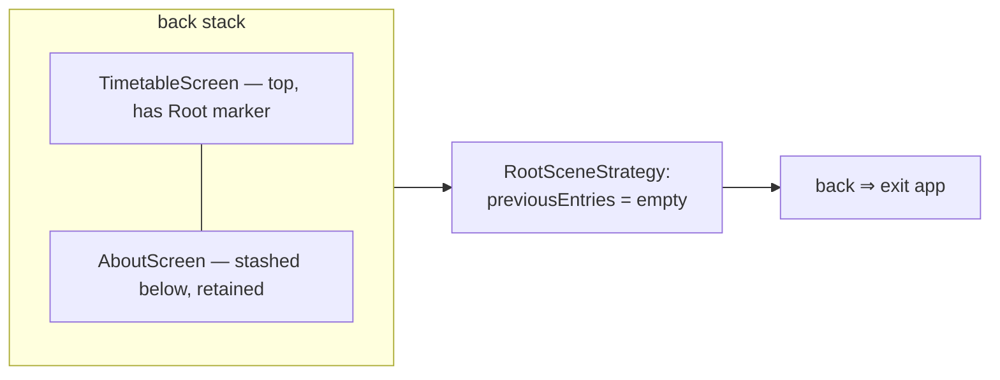
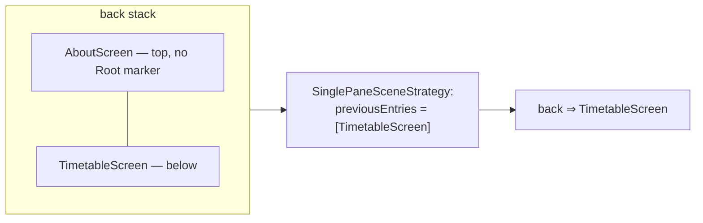

# ルート NavEntry のエミュレーション（RootSceneStrategy）

`RootSceneStrategy` は、選ばれた `NavEntry` をバックスタックの**仮想的なルート**として振る舞わせます。そのエントリが実際には最下部にない（他のタブがその下に退避している）ときでも、下には何もないかのようにバック入力を駆動します — そのためバックは、退避したエントリを見せるのではなく**アプリを終了します**。

## ゴール

- Timetable 以外のタブからのバック → **その直下に退避しているルート**へ戻ります。
- Timetable からのバック → **アプリを終了します**（Android では predictive back）。
- ルートタブはナビゲーションをまたいで**状態を保持します**（これが後述の predictive back の問題を生み出します）。

## `previousEntries` による predictive back

タブごとの状態保持のために、アプリは 1 本のバックスタックの中でホームルート（Timetable）の**下に**他のタブの NavKey を**退避**させておくことがあり、それによってそれらのタブはナビゲーションをまたいで生き残ります。しかしそれは Timetable の下に実在のエントリを残すことになり、Nav3 はバックプレビューのシーンをシーンの **`previousEntries`** から導出します — そのため Timetable からの predictive back は、アプリを終了するのではなく「下のエントリを見せる」ことになってしまいます。

1 本のバックスタックを 2 つの状態で示します — 最上位のエントリがシーンを決め、そのシーンの `previousEntries` がバックの挙動を決めることに注意してください。

**状態 A — TimetableScreen が最上位、AboutScreen がその下に退避:**



TimetableScreen の下のエントリ（AboutScreen）は実在しますが、TimetableScreen が Root マーカーを持つため、`RootSceneStrategy` は空の `previousEntries` を報告し、バックは AboutScreen を見せるのではなく終了します。

**状態 B — AboutScreen が最上位:**



AboutScreen はマーカーを持たないため `SinglePaneSceneStrategy` へ通り抜け、その `previousEntries` は下にある実在のスタックなので、バックは TimetableScreen へ戻ります。

`RootSceneStrategy` はまさにその点だけを解決し、それ以外は何もしません。ホームルートの識別は **`NavEntry.metadata` によって**行います。

```kotlin
class RootSceneStrategy<T : Any> : SceneStrategy<T> {

    override fun SceneStrategyScope<T>.calculateScene(entries: List<NavEntry<T>>): Scene<T>? {
        val entry = entries.lastOrNull() ?: return null
        if (RootSceneMetadataKey !in entry.metadata) return null   // not the home root → fall through
        return RootScene(entry)                                    // previousEntries = emptyList()
    }

    companion object {
        fun root(): Map<String, Any> = metadata { put(RootSceneMetadataKey, true) }
    }
}

private data object RootSceneMetadataKey : NavMetadataKey<Boolean>
```

`RootSceneStrategy` が返す `RootScene` は `previousEntries = emptyList()` を報告するため、ホームルートからの predictive back には戻る先がなく、下に何が退避していようと**アプリを終了します**。それ以外のエントリはすべて `null` を返し、`sceneStrategies` に残るストラテジ — [リスト-詳細のストラテジ](./navigation-list-detail.ja.md)、続いて `SinglePaneSceneStrategy`（その `previousEntries` は実在の `entries.dropLast(1)` です） — へ通り抜けます。そのため、ホームルート以外からのバックは、その下に退避しているエントリへ戻ります。

Root マーカーは、ホームルートのエントリにのみ、そのエントリが登録される場所で付与されます。

```kotlin
entry<TimetableNavKey>(metadata = RootSceneStrategy.root() + …) { … }
```

関連: [ルートタブバー（RootTabSceneDecorator）](./navigation-root-tab-bar.ja.md) · [アーキテクチャ概要](./architecture-overview.ja.md) · [Navigator](./navigation-navigator.ja.md) · [エントリの保持（RetainNavEntryDecorator）](./navigation-retain-entry-decorator.ja.md)
