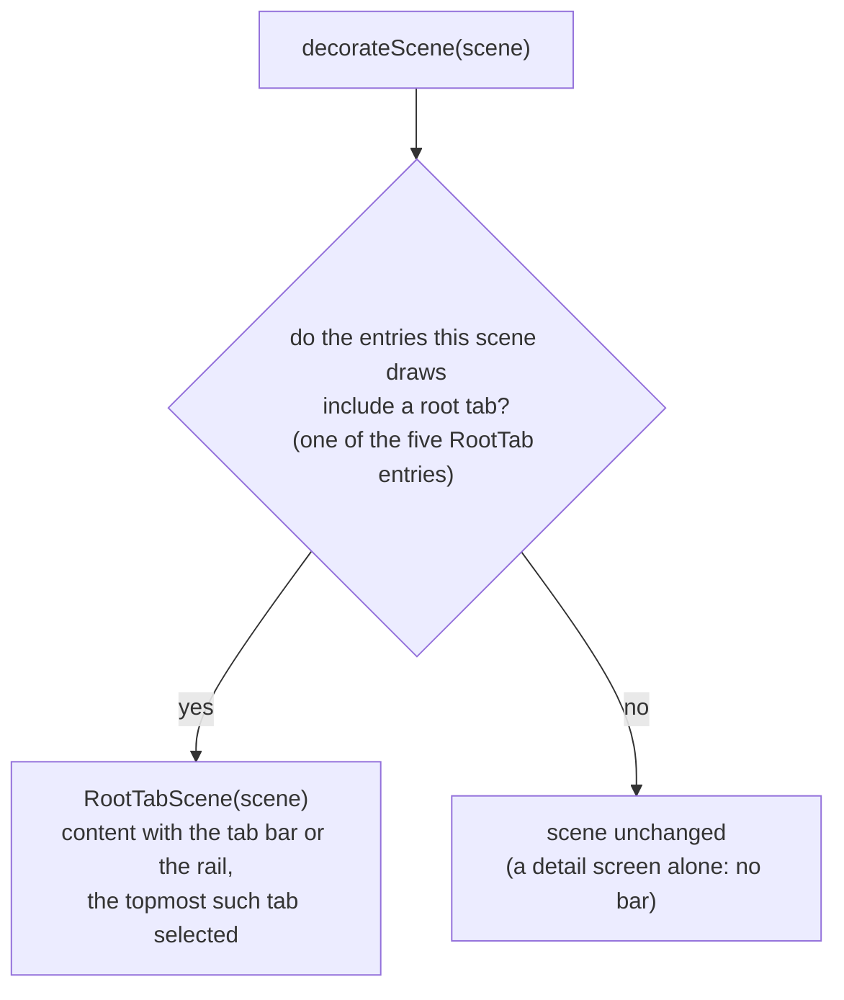

# ルートタブバー（RootTabSceneDecorator）

ルートデスティネーションを運ぶナビゲーション — ボトムバー、あるいは expanded ウィンドウでは leading エッジに沿ったレール — は、Nav3 の `SceneDecoratorStrategy`（`:app-shared` にある `RootTabSceneDecorator`）が追加し、`NavDisplay(sceneDecoratorStrategies = listOfNotNull(rememberRootTabSceneDecorator(…)))` に渡されます。このリストが null を許容するのは、バーがネイティブである iOS では `rememberRootTabSceneDecorator` が `null` を返すためです。

## どのように構築されるか

`decorateScene` は、そのシーンがどのルートタブを表示しているかを問います。すなわち、そのシーンが描画するエントリのうち、5 つのルートタブ（`RootTab` enum が宣言する `Timetable` / `EventMap` / `Favorites` / `About` / `ProfileCard`）のいずれかを指す最上位のエントリです。合致した場合は、delegate のコンテンツにバーまたはレールを追加したシーンを返し、そうでなければシーンを**そのまま**返します — したがって単独で表示される詳細画面にはどちらもありません。

複数のエントリを描画するシーン — expanded ウィンドウでの [リスト-詳細](./navigation-list-detail.ja.md) シーン — は、その上にある詳細の横にリストペインを画面上に保ちます。そのリストペインはルートデスティネーションなので、デスティネーションはそのタブが選択された状態で画面上に残り、別のタブへはワンタップで移れます。compact ウィンドウで到達した同じ詳細は 1 エントリのシーンであり、どのルートタブにも合致せず、バーを持ちません。

ラッパーである `RootTabScene` は `content` をオーバーライドし — [バーかレールか](#バーかレールか) が述べるとおり、delegate のコンテンツにバーまたはレールを追加したものです — 加えて `equals` / `hashCode` もオーバーライドするため、シーンは delegate と選択中のタブの両方が保たれている間だけ再利用されます。それ以外はすべて装飾対象のシーンに委譲されるので、この装飾はナビゲーションのセマンティクスを何も変えません。

> `NavEntry.key` は Nav3 では private なので、decorator は `Scene.entries` からキーを読み取れません。代わりにバックスタックを受け取り、`Scene.entries.size` を読みます。このアプリが形成するどのシーンもスタックの最上位のエントリ群を描画するため、その個数がどのキーが画面上にあるかを指し示します。例外は賞品ダイアログのようなオーバーレイのエントリで、Nav3 はその下のシーンを、さらにその下にあるエントリ群から形成します。そこで decorator は、スタック最上部のキーを entry provider を通じて解決し、そのエントリが `DialogSceneStrategy.dialog()` メタデータ — そもそもそのエントリをダイアログにしているのと同じ宣言です — を持つものを数える前に取り除きます。それらを数に入れてしまうと誤ったタブを指すことになり、さらにダイアログの下のシーンはダイアログが開いた瞬間に同一性が変わり、描画しているペインが空白になってしまいます。

## バーかレールか

`RootTabScene` はウィンドウ幅を読み取ります。EXPANDED ブレークポイント — 840dp 以上 — からは leading エッジに沿った垂直の `KaigiNavigationRail` がデスティネーションを担い、それより狭い場合は下端に配置された `KaigiNavigationBar` が表示されます（どちらも `:core:ui` のもので、同じ手描き風のピルとして描画されます）。この切り替えはウィンドウ幅のみに従い、シーンが描画するペインの数には決して従いません。詳細が開かれていない広いウィンドウでもレールが表示されます。

シーンが 2 つのペインを描画している間は、ペイン境界上のドラッグハンドル — レール列の右端にあり、ウィンドウの高さの中央に位置します — がレールを折りたたみます。列は指の動きに追従して全幅からゼロまで変化し、離すと落ち着き、空いた幅はペインに渡されます。ハンドルはレールが折りたたまれている間も表示されたままです。ほかにレールを戻す手段がないためです。そしてハンドルは 2 つ目のペインとともに画面から消えるので、2 ペインのレイアウトを離れるとレールが復帰します。レールが折りたたまれているかどうかは configuration change を越えて保持されます。

この 2 つは空間の占め方が異なります。

- **バー**は `Box` 内でコンテンツの上に浮かび、レイアウト上の空間を取りません。
- **レール**は `Row` 内で `KaigiNavigationRailDefaults.columnWidth` の列を占め、コンテンツ — リスト-詳細シーンの両方のペインを含みます — はその後ろから始まります。レールは、コンテンツがどんなヘッダーを描画するかとは無関係に、ウィンドウの高さに対して自身の列の中央に配置されます。

バーはプラットフォーム自身のナビゲーション領域 — Android のナビゲーションバー、3 ボタンでもジェスチャーピルでも — を `Modifier.windowInsetsPadding(WindowInsets.navigationBars)` によって避けます。これはバーをその inset の分だけ持ち上げ、システムがそこに描画するものの上に `KaigiNavigationBarDefaults.bottomMargin` を残します。この inset はデスクトップ、Web、およびスクリーンショットテストではゼロで、そこではバーはマージンの上だけに置かれます。

スクロール可能なルートデスティネーションは、ボトムのコンテンツパディングに `LocalNavigationBarOccupiedHeight.current` を加えることで、表示されている方を避けます。decorator はバーの下では `KaigiNavigationBarDefaults.occupiedHeightWithInset` — バー自身の広がりに、持ち上がった分の inset を加えたもの — を提供し、何の上にも浮かばないレールの横ではゼロを提供します。provider がインストールされていない場所では、この composition local は `KaigiNavigationBarDefaults.occupiedHeight` として読み取られ、これは iOS のネイティブバーが必要とする値です。UIKit はそのバー自身の高さを inset の分だけ大きくするためです。

## タブの切り替え

タブのタップは decorator からイベントとして伝播され、`KaigiApp` がそれを単一の `AppNavigator.selectTab(tab.key)` コマンドに変換するため、バックスタックが変更されるのは依然として `NavigatorEffect` の中だけです。`SelectTab` は**ポップではなく並べ替え**を行い、選択が外れたタブはスタックにスタッシュされたまま残り、切り替えを越えて保持された状態を保ちます。

- `[Timetable]` から **About** を選択するとプッシュされます: `[Timetable, About]`;
- 再び **Timetable** を選択すると並べ替えられます: `[About, Timetable]` — About は下で生き残ります;
- 再び **About** を選択すると: `[Timetable, About]` となり、About の状態はそのままです。
- すでに最上位にあるタブを選択しても何も並べ替えられません — 代わりに `NavigatorEffect` が `AppNavigator.reselections` に再選択を発行し、画面は `TabReselectEffect` を通じてそれを観測してコンテンツを先頭までスクロールバックさせます。

選択中の項目は、現在のシーンが示す最上位のルートを反映します。back は `NavDisplay` の `onBack` を通じて単一のスタックから抜け、最上位のすぐ下にスタッシュされているルートに到達します。ホームルートからは、下にタブがスタッシュされていてもアプリを終了します。[`RootSceneStrategy`](./navigation-predictive-back-tabs.ja.md) がその `previousEntries` を空にするためです。

## iOS

iOS ではバーがネイティブです。Compose のビューコントローラに重ねられた `UITabBar` である `RootTabBarView` が使われ、`RootTabSceneDecorator` は適用されません。タブのタップは `RootTabNavigator` を通じて届き、同じ `AppNavigator.selectTab` の経路に入るため、上記のバックスタックのセマンティクスはそのまま成り立ちます。詳細は [Liquid Glass タブバー](./ios-liquid-glass.ja.md) を参照してください。

関連: [ルート NavEntry のエミュレーション（RootSceneStrategy）](./navigation-predictive-back-tabs.ja.md) · [アーキテクチャ概要](./architecture-overview.ja.md) · [エントリの保持（RetainNavEntryDecorator）](./navigation-retain-entry-decorator.ja.md)
