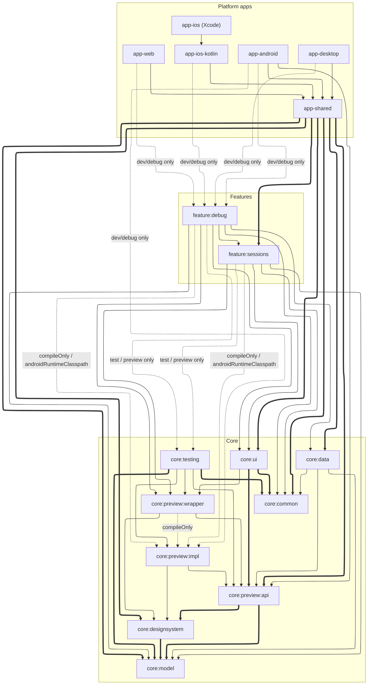

# モジュール構成

プロジェクトは 4 つのモジュールグループ — **`:core:*`**、**`:feature:*`**、**`:app-*`**、**ビルド時ツール** — に分かれており、それぞれを以下で説明します。

## `:core:*` — 基盤

feature を構成するもののすべて。core モジュールはどの feature についても知りません。

| モジュール | 役割 |
| --- | --- |
| `:core:model` | ドメインモデル、データ層の契約（Soil のキー宣言）、画面ごとの DI スコープマーカー |
| `:core:data` | データ層の実装 — API クライアント、永続化、Soil のキー実装 |
| `:core:common` | すべての feature が土台とする画面スキャフォールディングのプリミティブ — [ロールコンテキスト](./screen-context.ja.md)、一度きりのイベント配送、[ナビゲーション基盤](./navigation.ja.md) |
| `:core:designsystem` | テーマ |
| `:core:ui` | 共有 UI コンポーネント |
| `:core:testing` | 共有のテストスキャフォールディング（[テスト概要](./testing.ja.md)） |

## `:core:preview:*` — プレビュー基盤

プレビュー画像のバイナリを本番のクラスパスから締め出す 3 分割 — [プレビューとサンプルアセット](./preview.ja.md) を参照してください。

| モジュール | 役割 |
| --- | --- |
| `:core:preview:api` | 本番コードが参照してよい契約（型安全な画像ハンドル、リゾルバのインタフェース） |
| `:core:preview:impl` | 画像バイナリとリゾルバの実装。テスト / IDE プレビューのクラスパスにのみ届き、本番には決して届きません |
| `:core:preview:wrapper` | プレビューのラッパーとその DI グラフ。`:impl` はコンパイル時にのみ参照するため、バインディングは出荷されることなく集約されます |

## `:feature:*` — feature ごとに 1 モジュール

`:feature:sessions` / `:feature:contributors` / `:feature:sponsors` / `:feature:eventmap` / `:feature:about` / `:feature:favorites` / `:feature:profilecard` / `:feature:staff` / `:feature:settings` / `:feature:search`、および開発専用の `:feature:debug`。各モジュールは 1 つの feature の画面と NavKey を持ちます。feature が互いを import することは決してなく、唯一の例外が `:feature:debug` で、これは `:feature:sessions` に手を伸ばし、出荷されることはありません。

## `:app-*` — 集約とプラットフォームのエントリ

| モジュール | 役割 |
| --- | --- |
| `:app-shared` | 唯一の集約モジュール — アプリ全体の [DI グラフの契約](./di-app-graph.ja.md)、アプリシェル、エントリの集約、[feature 横断の navigator 実装](./navigation-navigator.ja.md) |
| `:app-android` / `:app-desktop` / `:app-web` | DI グラフを実体化する、プラットフォームごとのエントリポイント |
| `:app-ios-kotlin` | Xcode がリンクする Swift Export モジュール。DI グラフを実体化し、Compose の UI を view controller でラップして、Compose の型を含まないエクスポート面の背後に置きます |
| `app-ios`（Xcode プロジェクト） | SwiftUI のエントリポイントとネイティブのルートタブバー。エクスポート面を駆動します |

## ビルド時ツール

ビルド時にのみ適用され、いずれも実行時の依存ではありません。

| モジュール | 役割 |
| --- | --- |
| `:tools:compiler-plugin` | コンパイル時に[アーキテクチャのルールを強制する](./enforcement.ja.md) FIR checker |
| `:tools:ksp-processor` | [NavKey シリアライザのプロバイダ](./navigation-navkey-serializers.ja.md)を生成します |
| `gradle-conventions`（included build） | すべてのモジュールのビルドスクリプトが共有する [primitive / convention プラグイン](./build-convention-plugins.ja.md)（KMP のターゲット、Compose、スクリーンショットテスト、feature の結線） |

## デバッグツール

`:tools:jetwhale-plugin:protocol` と `:tools:jetwhale-plugin:host` は、アプリ自身の JetWhale プラグインをビルドします — 1 つの jar は、その manifest が宣言する数だけのプラグインを含みます。protocol モジュールは `:feature:debug` を通じて開発ビルドに届きます。host モジュールはデスクトップのデバッガが読み込む jar としてパッケージされ、アプリの一部になることはありません。clock はそこに置かれた最初のプラグインです — [Clock（KaigiClock）](./clock.ja.md) を参照してください。

## 依存グラフ

依存の方向: `feature → core:*`、`app-shared → (feature + core)`、`app-* → app-shared`。feature は互いに依存してはいけません。開発専用の `:feature:debug` は例外です。

上の表はモジュールの全体像を列挙しています。グラフを読みやすく保つため、図には**代表的な feature を 1 つ（`:feature:sessions`）**と、少し異なる **`:feature:debug`** だけを示しています — 他のすべての feature も同じように結線されます。

<!-- Generated by scripts/gen-module-graph.mjs — run it after changing module dependencies. -->
<!-- deps:start -->

<!-- deps:end -->

グラフの読み方。

- **凡例**: 太い辺は `api` 依存（推移的）、細い辺は `implementation`（モジュール内に閉じる）、点線の辺は本番以外の結線（`compileOnly`、開発専用、テスト専用）です。
- `:core:model` へ向かう辺は、単に*その型を使う*だけでなく*その契約を実装する*ことを意味する場合がよくあります。`:core:model` はインタフェースと Soil のキーを依存なしで宣言し、下流のモジュール（主に `:core:data`）が実装を提供して、DI グラフを通じて結び付けられます。
- feature 間の辺がなくても feature 横断のナビゲーションは機能します。各 feature は navigator インタフェースを宣言し、その実装は `app-shared` にあります — [Navigator](./navigation-navigator.ja.md) を参照してください。
- 点線の辺が `:feature:debug` と `:core:preview:impl` を本番から締め出す仕組み: [開発専用コードをリリースから除外する](./build-dev-only-exclusion.ja.md) · [プレビューとサンプルアセット](./preview.ja.md)。
- `:tools:*` と `gradle-conventions` 配下のツールは、依存されるのではなくコンパイラ / KSP / Gradle のプラグインとして適用されるため、グラフには現れません。そのうち唯一の実行時依存が `:tools:jetwhale-plugin:protocol` で、`:feature:debug` を通じて開発ビルドに届きます。

関連: [プラットフォームとモジュール](./platforms-and-modules.ja.md) · [AppGraph と UiGraph](./di-app-graph.ja.md)
